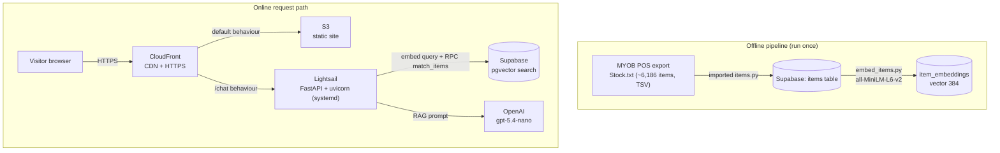

# Project Debrief — Swagat Supermarket AI Website & Chatbot

> **Personal interview-reference document.** Built solo by Ahmed Alboasi for a **real external business** (an Indian grocery store). Every claim below is backed either by a file in the repository (cited) or by my own recollection of building it. Anything I could not verify from the code is tagged **`[UNVERIFIED — confirm]`** so I never assert something I can't defend.
>
> Repository: [`Alboasiahmed/Supermarket`](https://github.com/Alboasiahmed/Supermarket) · Live site: `https://dtfi2l3y6igh2.cloudfront.net`
> Build window: **6 June 2026 → 30 June 2026** (19 commits) · plus AWS deployment.

---

## Table of Contents

1. [One-paragraph overview](#one-paragraph-overview)
2. [What was actually built vs. proposed](#what-was-actually-built-vs-proposed)
3. [Part 1 — Technical](#part-1--technical)
   - [1.1 Architecture](#11-architecture)
   - [1.2 Languages & frameworks](#12-languages--frameworks)
   - [1.3 Data & the ML/AI components](#13-data--the-mlai-components)
   - [1.4 Database & schema](#14-database--schema)
   - [1.5 APIs & integrations](#15-apis--integrations)
   - [1.6 AWS / infrastructure, service-by-service](#16-aws--infrastructure-service-by-service)
   - [1.7 Security & auth](#17-security--auth)
   - [1.8 Version control practices](#18-version-control-practices)
   - [1.9 Testing, CI/CD, tooling (honest gaps)](#19-testing-cicd-tooling-honest-gaps)
   - [1.10 Performance & cost decisions](#110-performance--cost-decisions)
   - [1.11 The hardest technical problems I solved](#111-the-hardest-technical-problems-i-solved)
4. [Part 2 — Non-technical / professional skills](#part-2--non-technical--professional-skills)
5. [Interview Cheat Sheet](#interview-cheat-sheet)
6. [Appendix — evidence index](#appendix--evidence-index)

---

## One-paragraph overview

I designed, built and deployed a complete, secure web application for a real Indian grocery store: a responsive marketing website plus an **AI "Store Expert" chatbot** that answers customer questions by **semantic search** over the store's ~6,186-product catalogue and then phrases a natural reply with a large language model. The system uses a **retrieval-augmented generation (RAG)** design with a deliberate **cost-control fallback**: if the LLM is disabled or fails, it automatically degrades to free search-only results. I owned the entire stack solo — database design, a data-import pipeline from the store's point-of-sale (POS) export, the embedding pipeline, the FastAPI backend, the vanilla HTML/CSS/JS frontend, and the full **AWS deployment** (S3 + CloudFront + Lightsail), including production security hardening.

---

## What was actually built vs. proposed

The client proposal (`AI Proposal - Grocery Store.pdf`) pitched **two** things: (a) a website + AI customer assistant, and (b) "smarter stock management" with demand/reorder **forecasting**.

| Promised in proposal | Status | Evidence |
|---|---|---|
| Responsive store website | ✅ Built & live | `index.html`, `CSS/style.css`, CloudFront URL |
| AI customer chatbot, linked to stock | ✅ Built & live | `Backend/chatbot.py`, `JS/chatbot.js` |
| Central, organised product database | ✅ Built | `database/schema.sql` (7 tables) |
| Stock forecasting / reorder prediction | 🔵 **Future phase — not yet implemented** | Schema *supports* it (`stock_movements`, `reorder_point`) but no forecasting code exists (Phase 2 answer #10) |

**Honesty note for interviews:** I never trained a custom ML model. I used a **pre-trained** sentence-embedding model and a **hosted** LLM via API (inference only). The "AI" here is applied embeddings + RAG, not model training. The forecasting/ML-prediction piece is *designed for* but *deliberately deferred* — I scoped Phase 1 to the website + chatbot so the client could see a working product early.

---

# Part 1 — Technical

## 1.1 Architecture

The system has two parts: an **offline data pipeline** (run once to load + index the catalogue) and an **online request path** (what happens when a customer chats).

Plain-English request flow: **Browser → CloudFront (HTTPS) →** either S3 (pages) or, for `/chat`, **the Lightsail FastAPI backend → which embeds the question, vector-searches Supabase, and asks OpenAI to write the reply** (falling back to a plain product list if AI is off/failing).

**Key design choice — one CloudFront, two origins.** Rather than expose the backend on its own insecure URL, I added the Lightsail backend as a **second origin** on the same CloudFront distribution and routed only `/chat` to it. This gives the API free HTTPS and makes it **same-origin** with the site, eliminating mixed-content errors and CORS complexity. (Configured live in the CloudFront console this build.)

---

## 1.2 Languages & frameworks

**Python (backend) — `What it is`: general-purpose language; here it runs the API and data pipeline.**
- *What I did:* wrote all backend logic in Python — the FastAPI app (`Backend/chatbot.py`), the import script (`Backend/imported items.py`), the embedding script (`Backend/embed_items.py`), and a connectivity check (`Backend/test_connection.py`).
- *Why it mattered:* Python is the lingua franca of AI/ML, with first-class libraries for embeddings, data handling and HTTP APIs.
- *What I learned:* structuring a small service into clear functions (`search_products`, `format_search_reply`, `ai_reply`) and isolating dependencies in a virtual environment.
- *Interview talking point:* "The backend's a Python FastAPI service. I kept it deliberately small — one `/chat` endpoint with three responsibilities: embed the question, search the database, and optionally call the LLM. That made it easy to reason about and to add a fallback path."

**FastAPI + Uvicorn — `What it is`: a modern async Python web framework and its ASGI server.**
- *What I did:* defined a typed `POST /chat` endpoint with a Pydantic request model (`ChatRequest`), CORS middleware, and ran it under Uvicorn (`Backend/chatbot.py`).
- *Why it mattered:* Pydantic gave me free request validation (I later used it to cap input length), and FastAPI's middleware model made CORS and rate-limiting clean to bolt on.
- *What I learned:* ASGI, request validation, and how a framework's defaults (e.g., allowed HTTP methods) can silently block a real feature if you don't configure them.
- *Interview talking point:* "FastAPI's Pydantic models meant my input-length security control was a one-line change on the request schema, not hand-written validation."

**Vanilla HTML / CSS / JavaScript (frontend) — no framework.**
- *What I did:* built a single-page responsive site (`index.html`, 263+ lines at first commit) with a custom-styled chat widget (`CSS/style.css`, 436+ lines) and a small async client (`JS/chatbot.js`) that POSTs to the backend and renders chat bubbles.
- *Why it mattered:* a static site is the cheapest, fastest thing to host (S3 + CloudFront) and needs no build step — ideal for a small business.
- *What I learned:* `fetch`/async-await, DOM manipulation, `white-space: pre-line` to preserve list formatting, and that the chat widget's open/close depends on a CSS class the JS toggles.
- *Interview talking point:* "I kept the frontend dependency-free on purpose — it deploys as plain files to S3, so there's nothing to build or patch."

---

## 1.3 Data & the ML/AI components

**The data — `What it is`: the store's real product catalogue.**
- *What I did:* imported a **MYOB point-of-sale export** (`Stock.txt`, tab-separated, **6,186 products** — confirmed) into Supabase via `Backend/imported items.py` — handling the TSV format, stripping `$`/commas from prices, mapping Department→category, falling back to CatHeader sub-category tags for descriptions, and flagging inactive items. Embeddings were generated for all **active** items (one inactive item excluded).
- *Real-world wrinkle (Phase 2 answer #4):* the 6,186 items came from an **older POS system**, so they were **not linked and the quantities were out of date** — meaning the catalogue is good for *search/discovery* but live stock levels would need a fresh feed before the forecasting phase.
- *Why it mattered:* this is genuine, messy, real-business data — not a toy dataset — which is exactly what made the project credible and instructive.
- *Interview talking point:* "I was handed a raw POS export of ~6,000 products from a legacy till system. Part of the job was data-cleaning: tab-separated parsing, price normalisation, category mapping, and marking inactive lines so discontinued products never surface in search."

**Embeddings — `What it is`: turning text into 384-number vectors that capture meaning (`sentence-transformers/all-MiniLM-L6-v2`).**
- *What I did:* `Backend/embed_items.py` builds a text blob per item (name + category + description), encodes it to a 384-dim vector, and upserts it into `item_embeddings`. I added **pagination** to work around Supabase's 1,000-row response cap so all items were embedded, not just the first 1,000 (commit `92c96d7` "fixing pipeline bugs").
- *Why it mattered:* embeddings are what let a customer ask *"what's good for biryani?"* and get basmati rice, garam masala and ghee — by **meaning**, not keyword match.
- *What I learned:* what an embedding is, vector dimensionality (384), cosine similarity, and that the **same** model must embed both the stored items and the live query for the vectors to be comparable.
- *Interview talking point:* "Each product is a 384-dimensional vector from all-MiniLM-L6-v2. A customer's question gets embedded the same way, and I find the nearest products by cosine distance — semantic search, so the wording doesn't have to match."

**RAG + the LLM — `What it is`: retrieval-augmented generation; retrieve real products, then let an LLM phrase the answer (`gpt-5.4-nano`).**
- *What I did:* `ai_reply()` in `Backend/chatbot.py` feeds the retrieved products to OpenAI with a system prompt constraining it to **only** recommend items from that list and to reply in plain text. The endpoint **always** runs the free search first; the LLM is layered on top.
- *Why it mattered:* grounding the LLM in real retrieved products keeps answers accurate and on-catalogue — it can't invent products we don't stock.
- *What I learned:* prompt design (constraining the model, stripping Markdown), the difference between `max_tokens` and `max_completion_tokens` on newer models, and per-request token cost.
- *Interview talking point:* "It's a RAG pattern: retrieval first, generation second. The model only ever sees the five products my search returned, and the prompt forbids it from recommending anything outside that list — so it stays factual."

**The fallback (graceful degradation) — a design feature I'm proud of.**
- *What I did:* a `USE_AI` flag + try/except so that if the owner disables AI to save money, or the key is missing/out of credit, or the API errors, the system **silently returns the search-only product list** instead of erroring (`Backend/chatbot.py`, commit `4a8df4c`).
- *Why it mattered:* it makes the LLM an *optional, owner-controlled cost*, not a hard dependency — the bot keeps working at $0 if needed.
- *Interview talking point:* "I treated the paid LLM as an enhancement, not a requirement. One environment flag turns it off, and any failure auto-degrades to free search — so the chatbot never shows the customer an error and the owner controls spend."

---

## 1.4 Database & schema

**Supabase (hosted PostgreSQL) + pgvector — `What it is`: a managed Postgres with a vector-search extension.**
- *What I did:* designed a **7-table relational schema** (`database/schema.sql`) and modelled it as an ERD (`Indian Groccery Store UML Plan.png`):

  | Table | Purpose |
  |---|---|
  | `categories` | product categories |
  | `suppliers` | supplier directory |
  | `items` | the catalogue (price, barcode, SKU, perishable flag, reorder point, active flag, timestamps) |
  | `stock_orders` / `order_items` | purchase orders to suppliers |
  | `stock_movements` | **movement-based** stock tracking (initial_count, delivery, sale, adjustment, return) rather than overwriting a quantity |
  | `item_embeddings` | `vector(384)` per item, `ON DELETE CASCADE` |

- *Notable design decisions:*
  - **Movement-ledger stock model** (`stock_movements`, `schema.sql:51–60`) — stock is an append-only history, not a mutable number. This is the foundation the future forecasting phase needs.
  - **`reorder_point`, `is_perishable`** on `items` — designed ahead for the reorder/expiry features in the proposal.
- *Vector search:* a `match_items` RPC (PostgreSQL function) does the similarity query with the `<=>` cosine operator and returns the top-K active products. **Note:** this RPC was created live in the Supabase console during deployment and is **not** in the repo; `schema.sql:69` specifies an **ivfflat** index. The exact live index type isn't certain — I should confirm it in the Supabase dashboard and align the repo. `[UNVERIFIED — confirm live index type (ivfflat vs HNSW) in Supabase, then reconcile schema.sql]`
- *What I learned:* relational modelling, foreign keys, why an event/movement log beats a mutable counter for auditability, and how pgvector exposes similarity search through an RPC.
- *Interview talking point:* "I modelled stock as a movement ledger, not a single quantity field — every delivery, sale and adjustment is its own row. It's auditable, and it's exactly the time-series shape you'd want for demand forecasting later."

---

## 1.5 APIs & integrations

- **Supabase API (`supabase` Python client):** all DB access — reads, upserts, and the `match_items` RPC call (`Backend/chatbot.py`, `embed_items.py`, `imported items.py`).
- **OpenAI API (`openai` client, `gpt-5.4-nano`):** RAG text generation (`ai_reply()` in `Backend/chatbot.py`).
- **My own `/chat` HTTP API:** consumed by the frontend (`JS/chatbot.js`).
- **"MandTrain":** *not part of this project.* I confirmed it appears nowhere in the codebase or git history; it was included in the template by accident (Phase 2 answer #8) and is intentionally omitted.
- *Honesty note:* `langchain` and `langchain-community` are listed in `requirements.txt` (I explored LangChain while learning — Phase 2 answer #5) but are **not imported anywhere** in the final code; the implementation calls the OpenAI SDK directly. I'd remove them in a cleanup.

---

## 1.6 AWS / infrastructure, service-by-service

> All AWS resources were configured **manually via the AWS Console** during deployment. There is **no infrastructure-as-code** (no Terraform / CloudFormation / serverless.yml / boto3) in the repo — an honest limitation and an obvious "next improvement."

**Amazon S3 — `What it is`: object storage; here, static website hosting.**
- *What I did:* created bucket `swagat-supermarket-site` (Sydney `ap-southeast-2`), uploaded the site, enabled static website hosting, and applied a public-read **bucket policy** (`s3:GetObject` for `Principal: *`).
- *Why it mattered:* cheapest possible hosting for static files; no server to manage.
- *Interview talking point:* "The whole frontend is static, so it lives in S3 with a read-only bucket policy — pennies a month and nothing to patch."

**Amazon CloudFront — `What it is`: a CDN that also terminates HTTPS.**
- *What I did:* created a distribution in front of S3; set **Redirect HTTP→HTTPS**; set the S3-website origin to **HTTP-only** (website endpoints don't support HTTPS); added a **second origin** (the Lightsail backend) and a **`/chat` cache behaviour** (CachingDisabled, AllViewer, POST allowed) so API calls route to the backend while everything else serves from S3.
- *Why it mattered:* free HTTPS, global caching/speed, and a single same-origin domain for both site and API (no CORS/mixed-content pain).
- *Interview talking point:* "I used one CloudFront distribution with two origins — S3 for pages, Lightsail for `/chat`. That gave the API HTTPS for free and kept it same-origin with the site."

**Amazon Lightsail — `What it is`: simplified VPS (EC2 under the hood) with flat pricing.**
- *What I did:* launched an **Ubuntu 22.04, 2 GB RAM / 2 vCPU / 60 GB** instance; installed Python + the project; added a **2 GB swap file** so the PyTorch install wouldn't OOM; ran the FastAPI app as a **systemd service** (`swagat.service`, `Restart=always`, auto-start on boot); attached a **static IP** (`3.105.140.39`); opened TCP **8000** in the Lightsail firewall.
- *Why it mattered:* the embedding model needs RAM and a warm, always-on process — a small server fits far better than serverless (a heavy model + cold starts make Lambda a poor fit).
- *Why Lightsail over EC2 (my reasoning):* it's **cheaper and more convenient to run for this use case** — flat $10/mo incl. data transfer, built-in browser SSH, fewer moving parts — right-sized for one small always-on service rather than EC2's pay-per-piece model and extra configuration.
- *Interview talking point:* "I chose Lightsail over raw EC2 because for my use case it was cheaper and more convenient — one small always-on service, so I wanted predictable flat pricing and fewer knobs to misconfigure, not auto-scaling I didn't need. I ran it under systemd so it survives reboots and crashes."

**AWS IAM — `What it is`: identity & access management.**
- *What I did:* secured the brand-new account before building — enabled **MFA** on root, created a separate **admin IAM user** for daily use, and stopped using root.
- *Interview talking point:* "First thing on a new AWS account: MFA on root, then a separate IAM user for day-to-day. You never build on the root credentials."

**AWS Budgets — cost guardrail.**
- *What I did:* set a **$20/month budget alert** so spend can never surprise me.

**Services I deliberately did *not* use** (and can justify): RDS/DynamoDB (I already had Supabase), Lambda/ECS (heavy ML model + always-on need), API Gateway, Cognito (no user logins), WAF (CloudFront's free Shield Standard is enough at this scale).

---

## 1.7 Security & auth

There's no end-user login (it's a public storefront), so "security" here means protecting the API, the keys, and the spend.

**Secrets management.**
- *What I did:* kept all keys in a git-ignored `.env` (`.gitignore`); when I made the repo public I first **verified the committed `.env` was empty (0 bytes)** and that no key (`sk-proj`, `sb_secret`) appears anywhere in git history.
- *Interview talking point:* "Before making the repo public I audited the whole git history for leaked keys — the tracked `.env` had been committed empty, so nothing sensitive ever shipped. The Supabase secret key lives only on the backend, never in the frontend."

**Production hardening (commit `5b14437`, `Backend/chatbot.py`).**
- **Rate limiting** — `slowapi`, **15 requests/min per IP**, so nobody can hammer `/chat` and run up the OpenAI bill.
- **Input length cap** — Pydantic `Field(min_length=1, max_length=500)` rejects oversized prompts (oversized → HTTP 422), bounding token cost.
- **Locked-down CORS** — `allow_origins` reads from an `ALLOWED_ORIGINS` env var (production set to the CloudFront domain), methods restricted to `POST`.
- *Interview talking point:* "Once an LLM endpoint is public it's effectively an open door to your bill, so I added per-IP rate limiting, a hard input-length cap, and CORS locked to my own domain — plus a hard monthly spend cap in the OpenAI dashboard as the final backstop."

---

## 1.8 Version control practices

- **Git + GitHub**, 19 commits over **6–30 June 2026** ([`Alboasiahmed/Supermarket`](https://github.com/Alboasiahmed/Supermarket)).
- **Conventional-commit style** in the later work: `feat(chatbot): …`, `feat(security): …`, `chore: ignore and untrack __pycache__`.
- **Good hygiene:** stopped tracking `.env` (`fcb9ab2`), later untracked the `__pycache__` build artefact and added it to `.gitignore` (`26dbbd8`).
- **A readable history arc:** website (06-06) → SQL schema (06-11) → import pipeline (06-11/14) → embeddings (06-12/14) → chat UI (06-19/23) → search backend (06-28) → LLM + fallback (06-30) → security hardening (06-30).
- *Interview talking point:* "You can read the project's whole story from the git log — I built it in layers: static site first, then the database and import pipeline, then embeddings, then the search backend, then the LLM, then security. Each layer was its own commit."

---

## 1.9 Testing, CI/CD, tooling (honest gaps)

I'd rather state these plainly than overclaim — interviewers respect knowing your gaps:
- **No automated tests** (no pytest suite). I tested manually with `curl` and a connectivity script (`test_connection.py`).
- **No CI/CD pipeline** — deployment was manual.
- **No Dockerfile / no linter config.**
- **`README.MD` is empty** (the project narrative lives in `CHATBOT_PROGRESS.md`, which I wrote during the build, and now this debrief).
- *Interview framing:* "If I productionised this, my first three additions would be a pytest suite around the search/fallback logic, a Dockerfile so the backend is reproducible, and a GitHub Action to deploy on push — none of which I needed for a solo Phase 1, but all of which I can explain why I'd add."

---

## 1.10 Performance & cost decisions

- **Pre-computed embeddings:** the expensive embedding of 6,000+ items runs **once, offline**; only the single short query is embedded per request — keeping the live path fast and cheap.
- **Model choice for cost:** I compared `gpt-5.4-mini` vs `gpt-5.4-nano` and chose **nano** — at ~20 customers/day the difference is roughly **$1.55 vs $0.43/month** (confirmed estimate), so I picked the cheaper model since the task (recommend from a supplied list) is simple.
- **`max_completion_tokens=300`** caps each reply's length (output tokens are the expensive side).
- **CachingDisabled on `/chat`** but caching on everything else — correct caching semantics (don't cache dynamic answers, do cache static assets).
- **Right-sized server:** 2 GB Lightsail (not the 512 MB plan, which can't even install PyTorch; not an oversized box).
- *Interview talking point:* "Cost was a real design input. Embeddings are pre-computed so the live cost is one tiny query plus an optional nano-model call — cents a month — and the owner can switch the LLM off entirely via a flag."

---

## 1.11 The hardest technical problems I solved

Each of these is a genuine debugging story I can narrate end-to-end.

1. **Only 1,000 of ~6,186 items were embedding.** Root cause: Supabase caps API responses at 1,000 rows. Fix: paginated the fetch with `.range(start, start+page_size-1)` until all rows were retrieved (commit `92c96d7`). *Lesson: always check for silent pagination limits on bulk reads.*

2. **MYOB export format mismatch.** The import script was written for a different format than the actual `Stock.txt`. Fix: audited the real columns and rewrote parsing (tab-separated, `dtype=str` to preserve long barcodes, category mapping, CatHeader description fallback) (commit `92c96d7`).

3. **A 500 error that the browser disguised as "can't reach the assistant."** Root cause: the `.env` `SUPABASE_URL` had been corrupted (the literal text `git reset HE` was appended to it), so DNS resolution failed. I reproduced it with a direct request, saw the real `getaddrinfo` failure, and fixed the URL. *Lesson: a frontend "can't connect" message can be masking a backend 500 — go to the source.*

4. **AI silently falling back to search (HTTP 401).** Root cause: a **stale `OPENAI_API_KEY` in the OS environment** was overriding the correct key in `.env`, because `load_dotenv()` doesn't override existing env vars. I spotted it because the *rejected* key's last 4 chars didn't match the `.env` key's. Fix: `load_dotenv(override=True)`. *Lesson: know your library's precedence rules.*

5. **`gpt-5.4`-series rejects `max_tokens`.** The newer model requires `max_completion_tokens`. Fix: one-line parameter change after reading the API error. *Lesson: read the actual error string; it told me exactly what to use.*

6. **CloudFront 504 Gateway Timeout.** Root cause: CloudFront tried to reach the S3 **website** endpoint over HTTPS, which S3 website endpoints don't support. Fix: set that origin's protocol to **HTTP-only** (viewer→CloudFront stays HTTPS; CloudFront→S3 is the internal hop). *Lesson: there are two legs to a CDN connection, and only the viewer-facing one needs to be HTTPS.*

- *Interview talking point (pick one):* "My favourite bug: the AI kept silently falling back to search. The OpenAI error said 'invalid key', but the key in my `.env` was valid. The giveaway was the last four characters of the rejected key didn't match my file — a stale key in the OS environment was winning, because `load_dotenv()` won't override an existing variable. One flag, `override=True`, fixed it."

---

# Part 2 — Non-technical / professional skills

> Key stories are in **STAR** format (Situation, Task, Action, Result).

### Understanding & defining the problem
- *What I did:* started from the client's actual day-to-day pain — manual stock counting and repetitive customer questions — and wrote a plain-language proposal (`AI Proposal - Grocery Store.pdf`) framing the solution in **business outcomes** (save time, waste less, reach more customers), not jargon. I scoped it into phases so the client could see value early.
- *Interview talking point:* "I led with the business problem, not the tech. The proposal never says 'embeddings' — it says 'the assistant can tell customers what's in stock'. The tech was in service of that."

### Client / stakeholder communication & requirements gathering — **STAR**
- **Situation:** A real, busy, owner-run grocery store with no existing digital systems beyond a legacy POS (Phase 2 answers #1, #2).
- **Task:** Understand how the shop actually runs and turn that into a concrete, low-risk build — as the **sole** person responsible.
- **Action:** Met the owner **twice a week for a month** (~8 sessions, Phase 2 answer #3), kept everything in plain language, and committed to a "start small, no obligation, free" approach to lower the client's risk.
- **Result:** A clear, agreed Phase-1 scope (website + chatbot) and a live, working product that I **demoed and handed over to the owner, who approved it** (Phase 2 confirmed) — with forecasting agreed as a later phase.

### Handling ambiguity & changing/limited inputs — **STAR**
- **Situation:** The product data was a ~6,186-row export from an **older POS system**.
- **Task:** Build useful search on top of data I couldn't fully trust.
- **Action:** I discovered the items **weren't linked and quantities were stale** (Phase 2 answer #4), so I made an explicit scope call: use the data for what it's *good* for — **search & discovery** — and defer live-stock features (forecasting) until a clean feed exists. I marked inactive items so they never surface.
- **Result:** A reliable chatbot built on imperfect data, with a clear, honest boundary on what it does and doesn't yet know. *This is the trade-off I'm most able to defend.*

### Teamwork & my role
- **Solo project** (Phase 2 answer #1) — I owned every layer: client comms, DB design, data pipeline, ML/embeddings, backend, frontend, AWS, security. The breadth is the story here.
- *Interview talking point:* "Solo, end-to-end — I was the analyst who scoped it with the client, the engineer who built it, and the ops person who deployed and secured it on AWS."

### Decision-making & trade-offs (a portfolio of defensible choices)
- **Lightsail over EC2** — predictable cost, fewer knobs, right-sized for one service.
- **`gpt-5.4-nano` over `mini`** — cheaper, and good enough for a constrained task.
- **RAG with fallback** — paid AI as an *optional enhancement*, not a hard dependency.
- **One CloudFront, two origins** — free HTTPS + same-origin, no CORS.
- **Movement-ledger stock model** — auditable and forecasting-ready.

### Self-directed learning — **STAR**
- **Situation:** As a first-year student, most of this stack (AWS, vector search, RAG, LangChain, systemd, CloudFront) was **new to me** (Phase 2 answer #5).
- **Task:** Ship a real product anyway.
- **Action:** Learned each piece just-in-time, in dependency order, and verified each layer worked before stacking the next (the git history shows this incremental approach).
- **Result:** A deployed, secured, working application — and a working mental model of cloud deployment I can now reuse.
- *Interview talking point:* "Almost none of this stack was taught to me — I learned AWS, pgvector and RAG on the job, one layer at a time, proving each worked before adding the next. The fact it's live is the evidence."

### Documentation & handover
- *What I did:* wrote `CHATBOT_PROGRESS.md` during the build (architecture, the three-phase plan, every bug + fix, run/restart instructions) and this debrief. *Gap I'd own:* the repo `README.MD` is empty — the living docs aren't yet the front door.

### Presenting / demoing
- *What I did:* the deliverable is a **live, shareable URL** (`https://dtfi2l3y6igh2.cloudfront.net`) — the strongest possible demo — which I **walked the owner through and handed over; the owner approved it** (Phase 2 confirmed). This was a personal/real-client project, not a graded university assessment.

### What I'm most proud of (Phase 2 answer #2, my words)
> "That it was actually to help a real-life business, using real-world data — I was able to understand the client's problems and create an excellent solution."

---

# Interview Cheat Sheet

### 🎤 30-second pitch
"I built and deployed an AI chatbot and website for a real Indian grocery store, solo. It takes a customer's plain-English question — like 'what do I need for biryani?' — embeds it into a vector, semantically searches the store's ~6,000-product catalogue in Postgres with pgvector, and uses an LLM to write a natural reply grounded only in the products we actually stock. I deployed the whole thing on AWS — S3 and CloudFront for the site, Lightsail for the backend — with rate limiting, a locked-down API and a cost-control fallback that runs the bot for free if the LLM is switched off. I learned most of the stack from scratch to ship it."

### 🛠️ Top 5 technical talking points
1. **RAG with graceful fallback** — retrieval first, LLM second, auto-degrade to free search on failure/cost-off.
2. **Semantic search with pgvector** — 384-dim `all-MiniLM-L6-v2` embeddings, cosine similarity via an `match_items` RPC.
3. **AWS deployment** — one CloudFront, two origins (S3 + Lightsail), HTTPS everywhere, systemd-managed backend, static IP.
4. **Production security** — per-IP rate limiting, input-length cap, locked CORS, audited git history for leaked keys, spend cap.
5. **Real-world data engineering** — cleaning a messy ~6,186-row legacy POS export into a queryable, indexed catalogue.

### 🤝 Top 3 professional / soft-skill stories
1. **Client-first scoping** — translated a busy shop-owner's pain into a phased, plain-language proposal; met ~8 times over a month.
2. **Honest scope under bad data** — recognised the POS data was stale/unlinked and deliberately deferred forecasting rather than fake it.
3. **Self-taught delivery** — learned AWS, pgvector and RAG on the job and still shipped a live product, layer by layer.

### ❓ Three likely questions + strong answers
- **"What was the hardest bug?"** → The silent AI fallback caused by a stale OS environment key overriding `.env` (HTTP 401); spotted it from mismatched key suffixes; fixed with `load_dotenv(override=True)`. *(See §1.11.)*
- **"Why didn't you use Lambda / why Lightsail?"** → The embedding model is heavy and needs a warm, always-on process; serverless cold-starts and size limits fight that. I wanted predictable flat cost and minimal config for one small service.
- **"Is this real ML? Did you train a model?"** → "I didn't train a model — I used a pre-trained embedding model and a hosted LLM for inference, in a RAG architecture. The engineering was in the retrieval, the grounding, the fallback and the data pipeline. The schema's movement-ledger design is what would feed a future forecasting model."

---

## Appendix — evidence index

| Claim | Evidence |
|---|---|
| FastAPI `/chat`, search + RAG + fallback | `Backend/chatbot.py` |
| Embedding pipeline + pagination fix | `Backend/embed_items.py`; commit `92c96d7` |
| POS import / data cleaning | `Backend/imported items.py`; commit `92c96d7` |
| 7-table relational + vector schema | `database/schema.sql`; `Indian Groccery Store UML Plan.png` |
| Security hardening | `Backend/chatbot.py`; commit `5b14437` |
| Dependencies | `Backend/requirements.txt` |
| Frontend | `index.html`, `CSS/style.css`, `JS/chatbot.js` |
| Client proposal | `AI Proposal - Grocery Store.pdf` |
| Commit history (06-06 → 06-30, 19 commits) | `git log` |
| AWS (S3/CloudFront/Lightsail/IAM/Budgets) | Console-configured this build (no IaC in repo) |
| Live deployment | `https://dtfi2l3y6igh2.cloudfront.net` |

### Items still marked `[UNVERIFIED — confirm]`
1. **Live vector index type** — `schema.sql` says ivfflat; the deployed index type is uncertain. Check it in the Supabase dashboard and align the repo. *(This is the only open item.)*

### Resolved (confirmed via Phase 2 follow-up)
- ✅ Item count: **6,186** products imported (embeddings for all active items).
- ✅ Cost figures (~$1.55 vs $0.43/month) confirmed.
- ✅ Live site was **demoed and handed over to the owner, who approved it**.
- ✅ EC2-vs-Lightsail rationale: **cheaper and more convenient for this use case**.
- ✅ Personal/real-client project, **not graded**.
